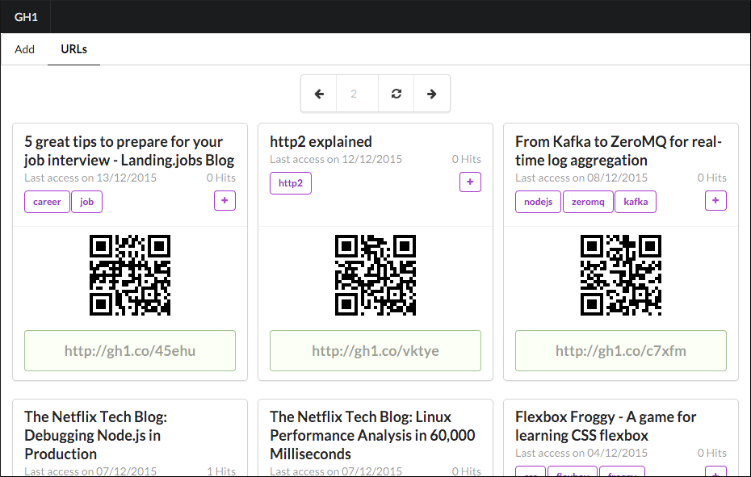
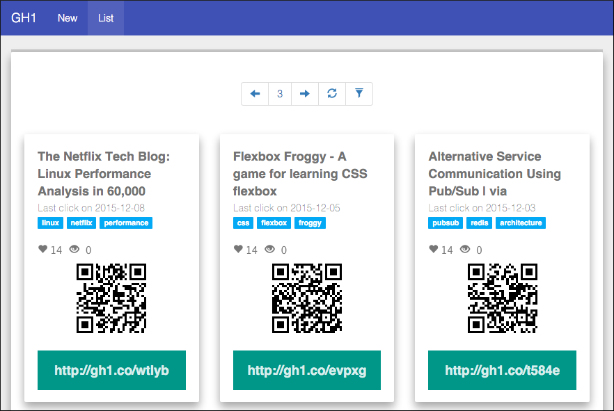

## About

It's my personal URL shortener writen in differents technologies. I used an architecture based on Restful API + SPA.

## Versions

### Golang + AngularJS 1.x + Semantic-UI

My first personal web app written in Go. I have studied Go for 2 weeks and I learned so much about it.
In this first version I learned about:

* Database operations with Postgres
* API using net/http and Gorilla Mux
* TDD and BDD in Go
* Godeps
* And much more

If you have tips or advices to improve my code please, share with me.

### NodeJS + ReactJS/Redux + Bootstrap3

I used Restify to develop a Restful API in NodeJS.

* I writen tests for React's Components and Actions
* Authentication using JWT (Json Web Token)
* Redux architecture instead of Flux
* React code writen in ES6 using Babel
* Gulp + Browserify + Babelify
* Restify for API

## License

MIT